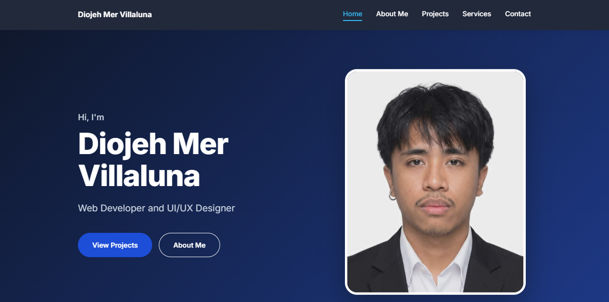

# Diojeh Portfolio

Personal portfolio website built to present my introduction, background, projects, and services in one place.

Live site: https://diojeh.vercel.app/



## Overview

This project is my personal portfolio. It shows who I am, the projects I have built, and the services I offer.

## Tech Stack

- React
- Vite
- JavaScript
- CSS
- Vercel

## Features

- Home section with an introduction
- About Me section
- Projects section
- Services section
- Navigation bar and footer

## Local Setup

```bash
npm install
npm run dev
```

## Project Structure

- `src/App.jsx` puts the page sections together
- `src/main.jsx` is the entry point of the app
- `src/components/` contains the Home, About, Projects, Services, Nav, and Footer sections
- `public/` stores images and assets
- `vercel.json` and `vite.config.js` hold the deployment and build settings

## Purpose

I use this site to showcase my work and make it easy for others to learn more about me.
